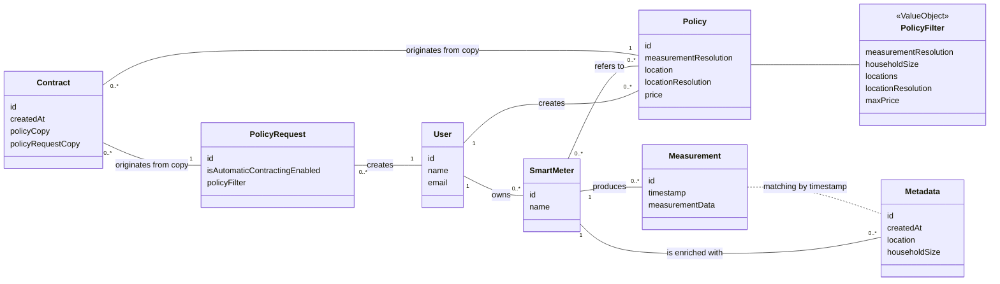

# smaiax-backend

## Domain Model

```mermaid
classDiagram
direction LR    
    
class User {
    id
    name
    email
}

class Contract {
    id
    createdAt
    policyCopy
    policyRequestCopy
}

class Policy {
    id
    measurementResolution
    location
    locationResolution
    price
}

class SmartMeter {
    id
    name
}

class Metadata {
    id
    createdAt
    location
    householdSize
}

class Measurement {
    id
    timestamp
    measurementData
}

class PolicyRequest {
    id
    isAutomaticContractingEnabled
    policyFilter
}

class PolicyFilter {
    <<ValueObject>>
    measurementResolution
    householdSize
    locations
    locationResolution
    maxPrice
}

Measurement .. Metadata : matching by timestamp
Contract "0..*" -- "1" Policy : originates from copy
Contract "0..*" -- "1" PolicyRequest : originates from copy
Policy "0..*" -- "1" User : creates
Policy -- PolicyFilter
PolicyRequest "0..*" -- "1" User : creates
User "1" -- "0..*" SmartMeter : owns
SmartMeter "0..*" -- "0..*" Policy : refers to
SmartMeter "1" -- "0..*" Measurement : produces
SmartMeter "1" -- "0..*" Metadata : is enriched with
```